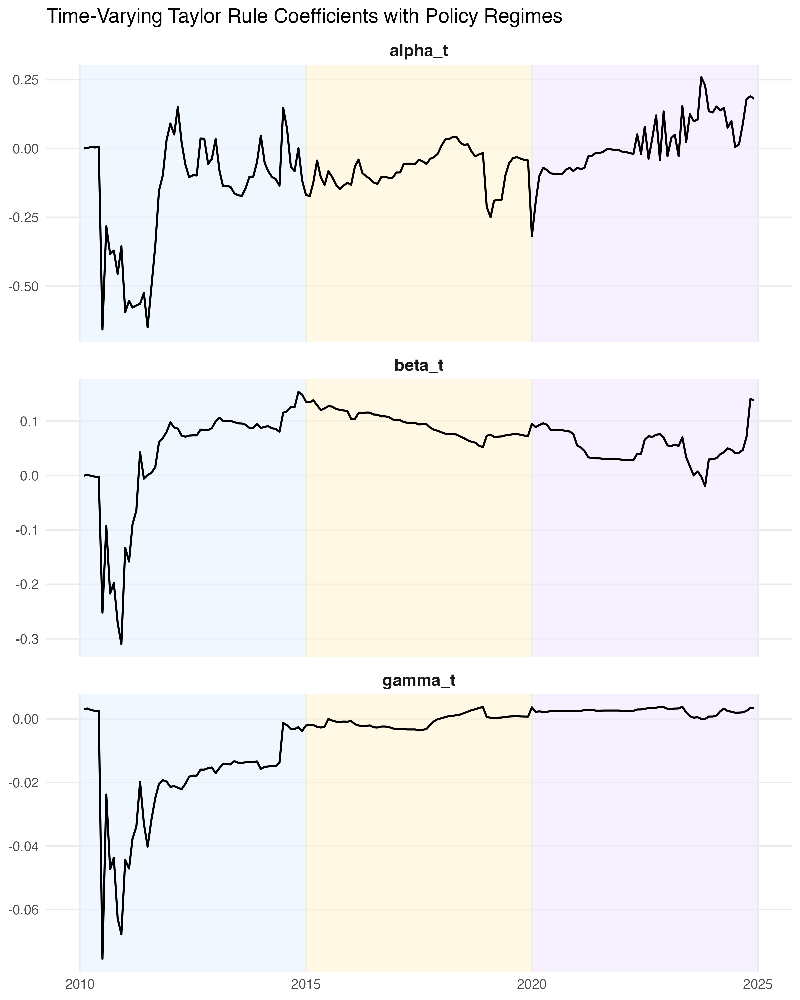
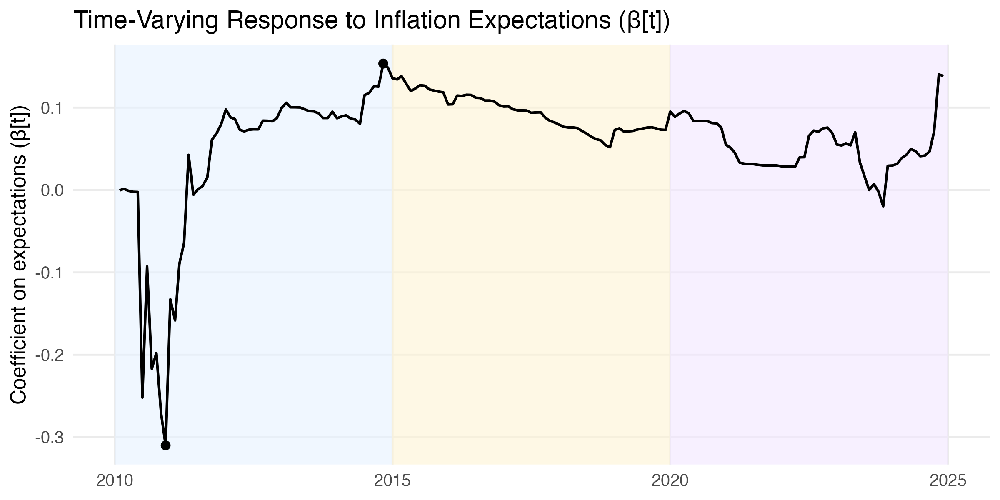
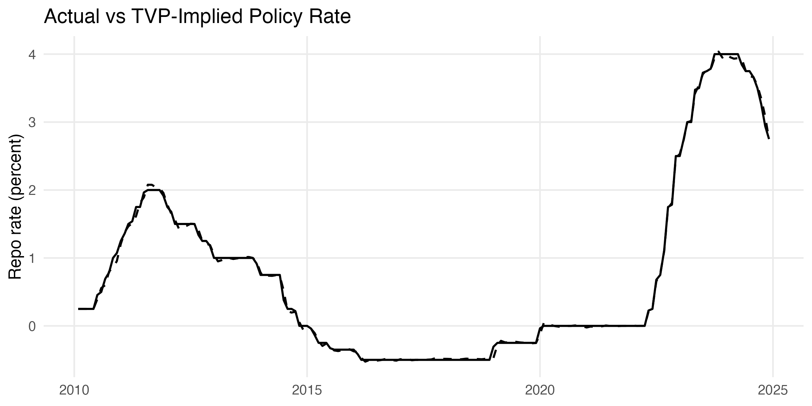

# sweden-tvp-taylor-rule
Time-varying Taylor rule estimated with a state-space model and Kalman filter to analyze the relationship between inflation expectations and monetary policy in Sweden (2010–2024).
# Time-Varying Taylor Rule for Sweden (2010–2024)

This project analyzes how the Riksbank’s responsiveness to inflation expectations has evolved over time.

A time-varying Taylor-type monetary policy rule is estimated using a **state-space model and the Kalman filter**, allowing the policy response coefficients to drift gradually across different macroeconomic regimes.

The analysis uses **monthly Swedish macroeconomic data (2010–2024)**.

---

# Research Question

How has the Riksbank’s responsiveness to inflation expectations evolved over time, and how does the influence of expectations vary across different monetary policy regimes?

---

# Data

Monthly Swedish macroeconomic data (2010–2024):

• Repo rate — Sveriges Riksbank  
• CPIF inflation — Statistics Sweden (SCB)  
• 1-year inflation expectations — Prospera / Origo survey  
• Unemployment rate — Statistics Sweden (SCB)

---

# Methodology

The monetary policy rule is modeled as a **time-varying Taylor rule**:

i_t = ρ i_{t−1} + α_t (π_t − π*) + β_t (exp_t − π*) + γ_t gap_t + ε_t

The coefficients evolve according to a random-walk process:

θ_t = θ_{t−1} + u_t

The model is estimated using **maximum likelihood with the Kalman filter and fixed-interval smoothing**.

---

# Key Findings

• The response to inflation expectations becomes clearly positive after 2012  
• Expectations remain an important component of Swedish monetary policy across regimes  
• The response to realized inflation strengthens primarily after the 2021 inflation surge  
• Economic slack plays only a limited role in the estimated policy rule

---

# Project Structure

R/
00_setup.R
01_data_cleaning.R
02_descriptives_raw.R
03_tvp_model.R
04_state_space_estimation.R
05_results_plots.R

Scripts are designed to run sequentially.

---

# Reproducibility

Run the scripts in order:

source("R/00_setup.R")
source("R/01_data_cleaning.R")
source("R/02_descriptives_raw.R")
source("R/03_tvp_model.R")
source("R/04_state_space_estimation.R")
source("R/05_results_plots.R")

---

# Tools

R  
State-space models  
Kalman filter  
Time-series econometrics

---

# Author

Jonas Engdahl  
MSc Economics — Stockholm University

## Selected Results

### Time-Varying Policy Coefficients

Estimated time-varying coefficients of the Taylor rule. Shaded areas indicate different monetary policy regimes.

---

### Response to Inflation Expectations

Zoomed view of the time-varying coefficient on inflation expectations.

---

### Model Fit: Implied vs Actual Repo Rate

Comparison between the model-implied policy rate and the observed repo rate.
